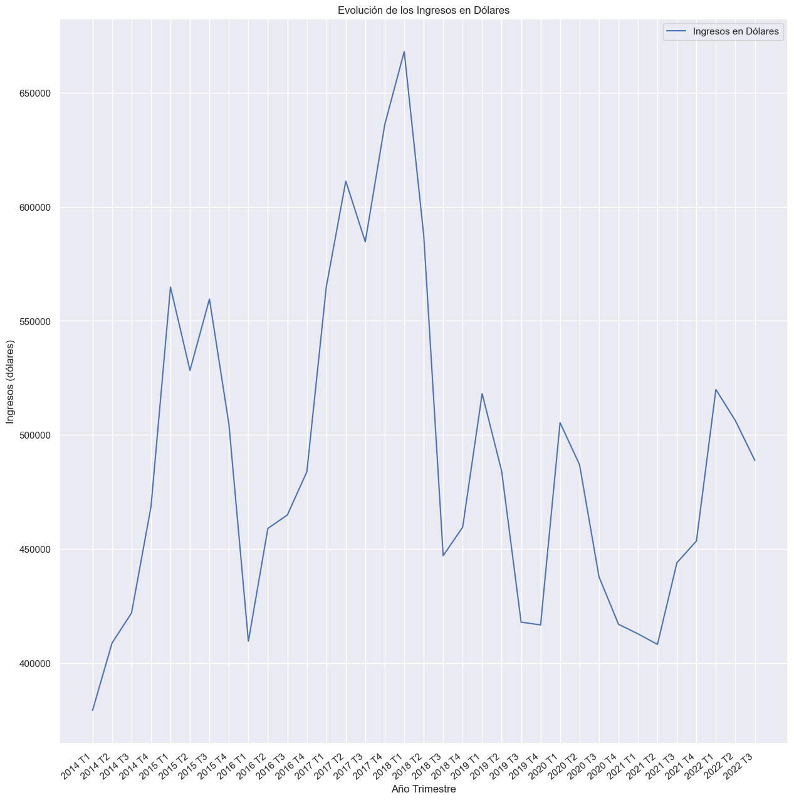
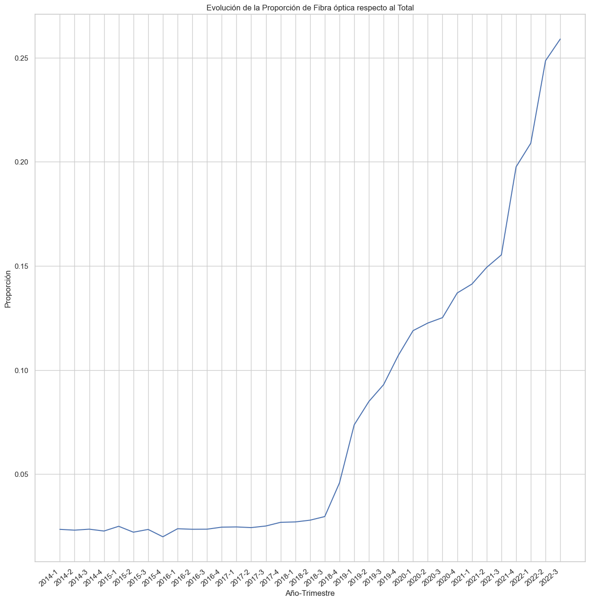
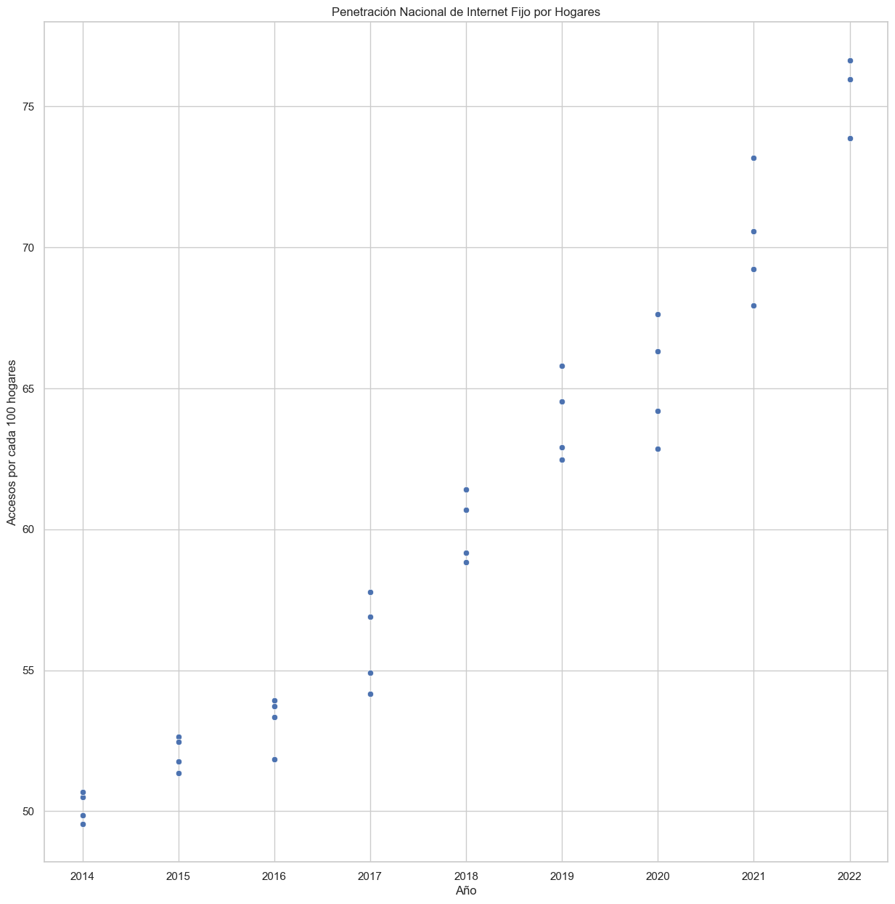
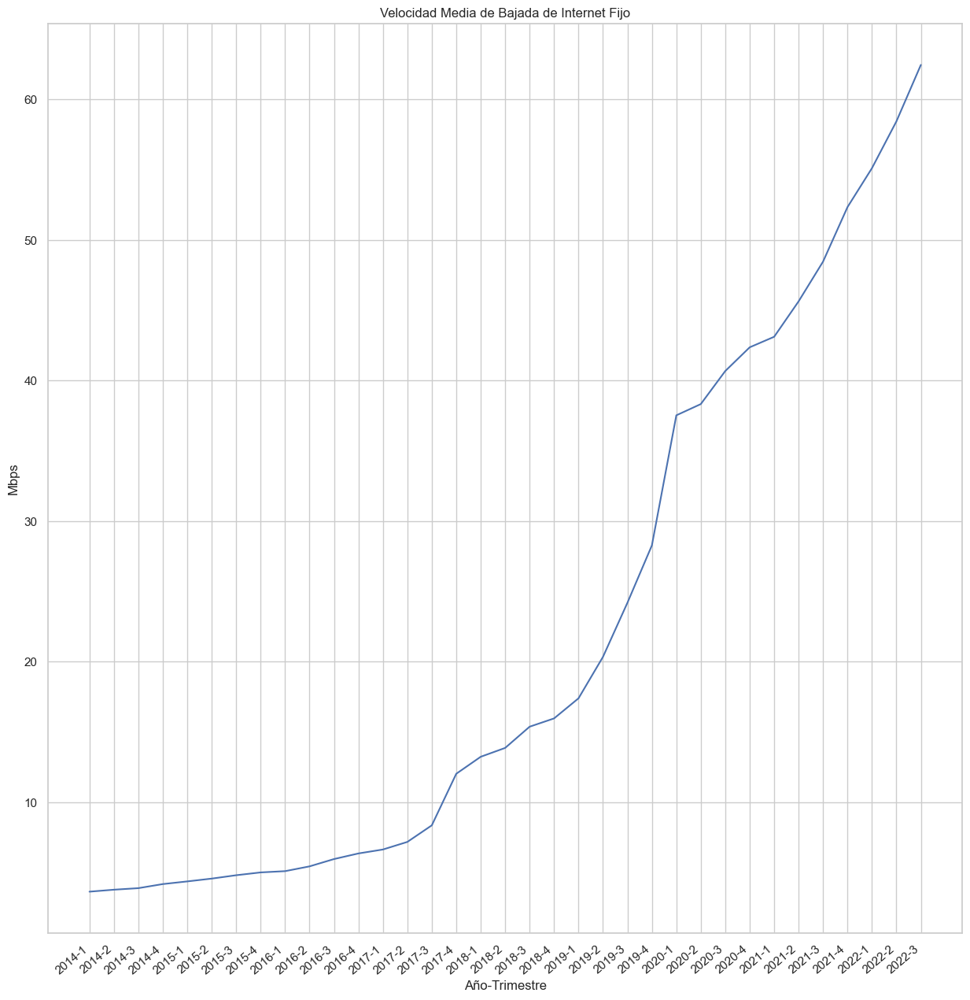

# Proyecto de análisis del sector de telecomunicaciones en Argentina 🇦🇷
___
A partir de la data sobre telecomunicaciones en Argentina obtenida [aquí](https://datosabiertos.enacom.gob.ar/dashboards/20000/acceso-a-internet/) se realiza un análisis exploratorio. A pesar de que el principal objetivo de este proyecto era la parte de EDA, KPIs y dashboard fue necesario realizar previamente algunas transformaciones ya que la data no estaba del todo limpia.

Dentro de la carpeta principal del repositorio pueden encontrar los 16 archivos .csv originales en crudo. Y dentro de la carpeta Data limpia se encuentran los mismos pero luego de las transformaciones, que son los que utilicé para el EDA.

En el archivo ETL.ipynb se trabajaron las transformaciones y en EDA.ipynb el análisis exploratorio de los datos.

En base a ese EDA los KPIs elegidos son:
- Proporción de Fibra óptica respecto del total de conexiones
- Promedio nacional de acceso a internet por cada 100 hogares
- Velocidad media de bajada
- Promedio de ganancia trimestral en dólares

**Y la conclusión es que si bien en Argentina hay factores como la inflación y cambios drásticos de políticas que influyen fuertemente en el sector de las telecomunicaciones hay una demanda mayoritaria de accesos a internet con las mejores velocidades y tecnologías disponibles. Por lo tanto seguir invirtiendo permanentemente en el mantenimiento y mejoramiento de las redes garantiza seguir aumentando la penetración en los hogares y mantener y/o aumentar los ingresos en dólares. Dentro de este contexto, actualmente la fibra óptica es la mejor opción. Dejo este interesante [link](https://www.rankia.com/blog/mejores-ofertas-internet/1994689-diferencias-adsl-fibra-optica) al respecto de sus beneficios.**

[Fuente](http://estudiodelamo.com/cotizacion-historica-dolar-peso-argentina/) que utilicé para convertir pesos a dólares. 

***

Mi nombre es Adrian Szklar, muchas gracias por haber llegado hasta acá y para todo tipo de sugerencias, observaciones, correcciones, etc. dejo mis mails y mi perfil de Lindedin:
- szklaradrian@gmail.com
- szklaradriandatos@gmail.com
- [www.linkedin.com/in/adrian-szklar](https://www.linkedin.com/in/adrian-szklar/)
